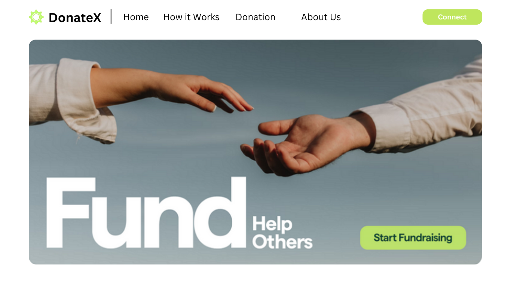
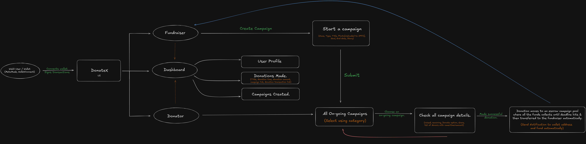

# DonateX

#### A Transparent Web3 Donation Platform Built with Smart Contracts & On-Chain Indexing for Secure & Trustless Fundraising.


<!-- Once build is complete, remove the design image above & add demo here. -->


## ⚠️ Problem to Solve.

Donating online often lacks transparency. Donors rarely know where their money goes & nonprofits struggle to manage contributions in a visible, trustworthy way.

Traditional platforms don’t support crypto well and existing Web3 tools can be too complex or technical for everyday users.

There’s a need for a simple, secure and transparent platform that makes crypto donations easy—for both donors and campaign creators.


## ✅ Possible Solution.

**DonateX** is an ETH-based, Entry-level Web3 donation platform that demonstrates secure smart contracts, on-chain transparency & indexed data dashboards.

Here's how it works:

1. **Campaign Creation** : Users can create fundraising campaigns with a title, description, image, funding goal & deadline. Campaign metadata is stored in decentralized storage (IPFS), while ownership and funding logic are handled on-chain.

2. **Crypto Donations (ETH/POL)** : Donors can contribute to active campaigns through a secure smart contract. All donations are recorded on-chain, ensuring transparency & immutability.

3. **Donation Pooling via Smart Contracts** : Funds are pooled within the smart contract instead of being transferred instantly, preventing misuse and enabling controlled fund releases.

4. **Automated Fund Withdrawals** : Campaign creators can withdraw funds automatically once campaign conditions are met (e.g., funding goal reached or campaign completed), eliminating manual intervention.

5. **Indexed Dashboards for Donors & Campaigners** : A dedicated dashboard showing Campaigns created by a user, Donations made by a user, Campaign funding progress (amount raised, amount remaining), Transaction history and timestamps. Blockchain events are indexed to enable fast and efficient data retrieval.

6. **On-Chain Transparency & Auditability** : All campaign creation, donations and withdrawals are publicly verifiable on the blockchain, building trust between donors and campaign creators.


## ⚙️ Architecture.




## 🛠 Tools, Languages & Frameworks used.

- **React.js :** For building the frontend user interface.
- **Ethers.js :** To interact with the Ethereum (or Polygon) blockchain.
- **Node.js :** Backend runtime environment for server-side JavaScript.
- **Express.js :** Web framework for building RESTful APIs on Node.js.
- **Solidity :** For writing smart contracts that handle donations and campaign logic.
- **Hardhat :** For compiling, testing and deploying smart contracts.
- **RainbowKit :** For connecting user wallets to the dApp.
- **IPFS :** To store campaign metadata like images and descriptions in a decentralized way.
- **The Graph :** Indexing and querying protocol for fast blockchain data retrieval.


## 👨‍💻 Project Building Steps.

1. Design & build the frontend UI, including pages and routes for:
   - Campaign listing and details,
   - Campaign creation,
   - Donor and campaigner dashboards.

2. Integrate Web3 wallet connection (MetaMask) for user authentication & transactions.

3. Design, write and deploy smart contracts to:
   - Create and manage donation campaigns,
   - Pool donations securely,
   - Track donors, campaign progress and deadlines
   - Automatically release funds to campaign creators upon completion.

4. Integrate IPFS to store decentralized campaign metadata
   (title, description, images and story content).

5. Implement The Graph as a unified indexing layer to:
   - Index campaign creation and donation events,
   - Enable real-time campaign statistics,
   - Support historical donation and funding analytics.

6. Connect the frontend to smart contracts using Ethers.js to:
   - Create campaigns,
   - Donate to campaigns,
   - Fetch on-chain and indexed data.

7. Build donor and campaigner dashboards using indexed data to display:
   - Donations made and received
   - Campaign status, progress and transaction history.

8. Display live campaign progress and total funds raised using indexed and on-chain data.

9. Test, debug and deploy the full-stack decentralized application.


## 📂 Folder Structure.

* **client:** Contains the frontend codebase.
* **server:** Contains the Solidity smart contracts.

```

├─client/
| ├─public/
│ │  └─ assets/         # Static files (Images, icons and other media files)
| ├─src/
│ | ├─ components/      # Small, reusable UI components.
│ | ├─ sections/        # Main page sections. (Hero, Tech Stack, Projects, etc.)
│ | └─ pages/           # Detailed/Featured pages for projects, blogs and experience.
| ├─ App.css            # Styles specific to the App component or top-level component styling.
| ├─ App.jsx            # Root file that assembles sections and manages routing.
| ├─ index.css          # Global styles, CSS resets and base theme styles.
| ├─ main.jsx           # Bootstraps the React app & wraps it with Wagmi, RainbowKit and React Query providers to enable wallet connections, blockchain interactions and efficient data fetching across the entire application.
| └─ wagmi.js           # Sets up wallet connectivity & blockchain network support for the dApp using RainbowKit & Wagmi.
├─server/
| ├─contracts/          # Contains all the Solidity contracts.
| ├─ignition/           # Contains Hardhat Ignition deployment modules that describe how to deploy your contracts.
| ├─test/               # Contains TypeScript and Solidity tests.
| └─ hardhat.config.js  # Project’s main configuration file. Defines the Solidity compiler version, network configurations, plugins and tasks.

```


## 🧑‍💻 Contributions to this repo are WELCOME.👋

* 🎨 Any improvements to the design and UI are welcome.
* 🔨 Try to break the website by testing it to find any bugs. If you find any, check if there is an issue already open for it, if there is none, then report it.


## 🔃 Steps to be followed in order to make valid contributions to this repo.

**1.** Fork the [DonateX](https://github.com/mrinnnmoy/DonateX) repo by clicking on the fork button on the top of the page. This will create a copy of this repository in your account.

**2.** Clone the forked repository

        git clone "https://github.com/<your-github-username>/DonateX"

* Download and install Node JS v16.16.0
* Download and install Git.
* Go to the terminal of your code editor and run "npm install" to download packages.
* Run "npm run dev" to start a local server.

**3.** Make necessary changes and commit those changes. <br />
Remember never push anything to the Main branch. <br />

Always change your branch to "develop" using:

    git checkout develop

Again check your current branch using:

    git branch

It should point \*develop

Now add your changes using:

    git add files-you-edited

If there are multiple files you can use:

    git add .

Now create a commit message using:

    git commit -m "<commit-message-goes-here>"

**4.** Push changes to GitHub

    git push origin develop

**5.** Create a Pull Request 👋<br>

Now you go to your repository on GitHub, you’ll see a `Compare & pull request` button. Click on that button and now write a summary of what changes you have done.( Attach images if required). I will review your code and merge it if it passes all the tests.❤️