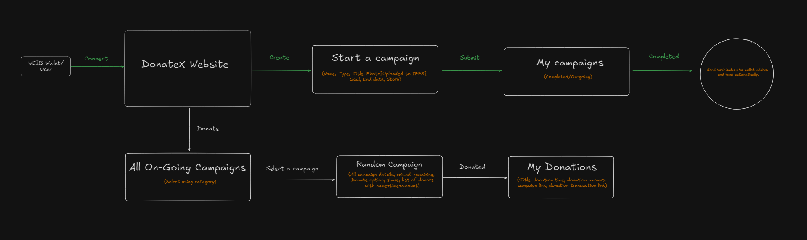

# DonateX

Transparent Donation Matching and Automated Payment Workflows for Web3 Fundraising.

## ⚠️ Problem to Solve. 

It’s hard for donors to see where their money goes, especially in matched donations. Nonprofits struggle to manage and distribute funds fairly. Existing tools don’t work well with crypto and require a lot of manual effort.

There’s a need for a simple platform that makes donations and fund distribution clear, automatic and secure for everyone.

## ✅ Possible Solution.

**DonateX** is a user-friendly platform that simplifies donation matching and fund distribution through:

1. **Transparent Matching**: Automatically matches donations and shows donors how much has been matched, with real-time progress updates.

2. **Automated Payouts**: Releases funds to nonprofits automatically based on milestones, reducing manual work and ensuring transparency.

3. **Easy Donations**: Allows users to donate in crypto or via credit card, making it accessible for everyone.

4. **On-Chain Tracking**: Keeps all donation records visible on the blockchain, building trust and accountability.

## ⚙️ Architecture.

[Excalidaw File...](https://excalidraw.com/#json=mT_EDiuyR2xpqcj42jurn,VeSfDcnxrnRsewaWReJqqw)

## 🛠 Tools, Languages & Frameworks used.

- **ReactJS :** Frontend library for building interactive user interfaces.
- **Chakra UI :** UI library for responsive, accessible and customizable components.
- **Ether.js :** JavaScript library to interact with the Ethereum blockchain.
- **Node.js :** Backend runtime environment for server-side JavaScript.
- **Express.js :** Web framework for building RESTful APIs on Node.js.
- **IPFS :** Decentralized storage for campaign metadata like images and descriptions.
- **Solidity :** Smart contract language to handle donations and campaign logic on Ethereum.
- **WalletConnect :** Protocol enabling mobile wallet connections to the dApp.
- **Push Protocol :** Decentralized notifications for user alerts and campaign updates.
- **The Graph :** Indexing and querying protocol for fast blockchain data retrieval.
- **Streamflow :** Protocol for automated, secure fund transfers to campaign creators.

## 📂 Folder Structure.

* **client:** Contains the frontend codebase.
* **server:** Contains the Solidity smart contracts.

## 🧑‍💻 Contributions to this repo are WELCOME.👋

* 🎨 Any improvements to the design and UI are welcome.
* 🔨 Try to break the website by testing it to find any bugs. If you find any, check if there is an issue already open for it, if there is none, then report it.

## 🔃 Steps to be followed in order to make valid contributions to this repo.

**1.** Fork the [DonateX](https://github.com/mrinnnmoy/DonateX) repo by clicking on the fork button on the top of the page. This will create a copy of this repository in your account.

**2.** Clone the forked repository

        git clone "https://github.com/<your-github-username>/DonateX"

* Download and install Node JS v16.16.0
* Download and install Git.
* Go to the terminal of your code editor and run "npm install" to download packages.
* Run "npm run dev" to start a local server.

**3.** Make necessary changes and commit those changes.  
Remember never push anything to the Main branch.  

Always change your branch to "develop" using:

    git checkout develop

Again check your current branch using:

    git branch

It should point \*develop

Now add your changes using:

    git add files-you-edited

If there are multiple files you can use:

    git add .

Now create a commit message using:

    git commit -m "<commit-message-goes-here>"

**4.** Push changes to GitHub

    git push origin develop

**5.** Create a Pull Request 👋 

Now you go to your repository on GitHub, you’ll see a `Compare & pull request` button. Click on that button and now write a summary of what changes you have done.( Attach images if required). I will review your code and merge it if it passes all the tests.❤️